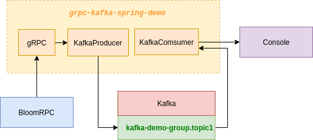

# gRPC Kafka Spring boot Demo

Simple spring boot application using Kafka, gRPC

## Prerequirements

* Install Apache Kafka
* Some useful script to run kafka [here](./scripts)
  * `sz.sh` : Run zookeeper
  * `sv.sh` : Run kafka server
  * `gc.sh` : Clean logs
 
## Architecture

<div align="center">
 
</div>


## Deployment

1. Remove log:

```sh
$ ./gc.sh
```

2. Start zookeeper:

```sh
$ ./sz.sh
```
3. Start server:

```sh
$ ./sv.sh
```

4. Run Application

5. Use [bloomRPC](https://github.com/uw-labs/bloomrpc) to test

## Reference Documentation
For further reference, please consider the following sections:

* [Official Apache Maven documentation](https://maven.apache.org/guides/index.html)
* [Spring Boot Maven Plugin Reference Guide](https://docs.spring.io/spring-boot/docs/2.1.9.RELEASE/maven-plugin/)
* [Spring for Apache Kafka](https://docs.spring.io/spring-boot/docs/2.1.9.RELEASE/reference/htmlsingle/#boot-features-kafka)
* [Apache Kafka Streams Support](https://docs.spring.io/spring-kafka/docs/current/reference/html/_reference.html#kafka-streams)
* [Apache Kafka Streams Binding Capabilities of Spring Cloud Stream](https://docs.spring.io/spring-cloud-stream/docs/current/reference/htmlsingle/#_kafka_streams_binding_capabilities_of_spring_cloud_stream)

## Guides
The following guides illustrate how to use some features concretely:

* [Samples for using Apache Kafka Streams with Spring Cloud stream](https://github.com/spring-cloud/spring-cloud-stream-samples/tree/master/kafka-streams-samples)

